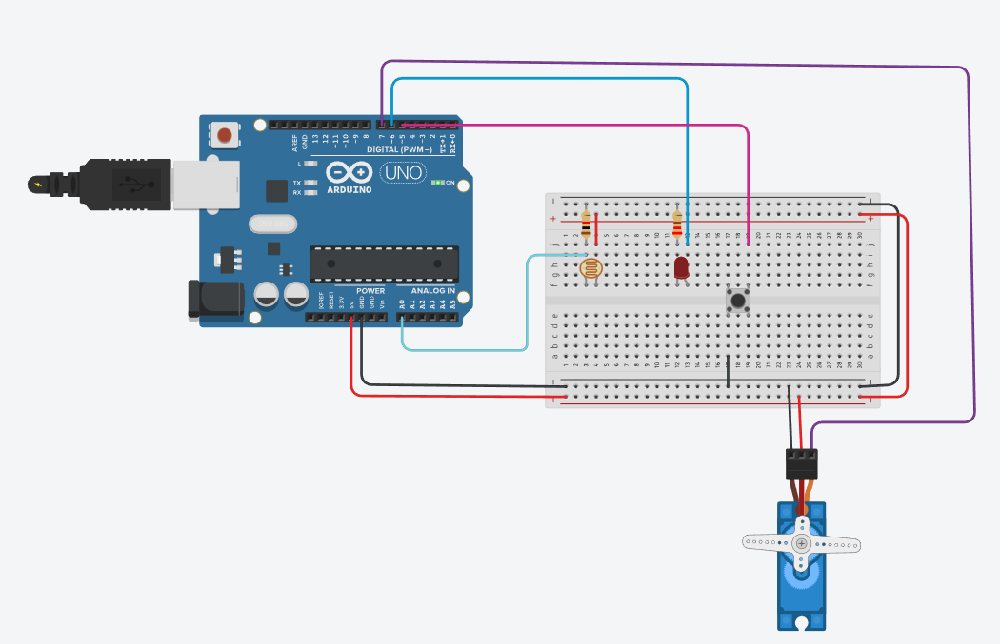

# 🛗 Simulador de Elevador – Versão com Sensor de Porta, Botão Físico e Servo Motor

Esta branch contém uma versão mais completa do simulador de elevador, incluindo:

* Botão físico para chamada do elevador
* Sensor LDR simulando detecção de obstáculo na porta
* LED indicando abertura/fechamento da porta
* Servo motor simulando o motor do elevador
* Fluxo completo com máquina de estados e fila de destinos
* Interação via Serial Monitor

Ideal para demonstrações práticas em **protoboard**, **Tinkercad** ou Arduino real.

---

## 📸 **Esquema de Ligação (Circuito Completo)**

A imagem abaixo representa a montagem utilizada nesta branch:



---

## ⚙️ **Componentes Utilizados**

| Componente           | Função                                         |
| -------------------- | ---------------------------------------------- |
| Arduino Uno          | Microcontrolador principal                     |
| Servo SG90           | Simula deslocamento do elevador (subir/descer) |
| LDR + Resistor       | Sensor de obstáculo da porta                   |
| LED + Resistor       | Indica porta aberta/fechada                    |
| Botão físico         | Chamar elevador                                |
| Protoboard e jumpers | Conexões                                       |

---

## 🧩 **Funcionamento da Lógica**

### 🛗 Máquina de Estados

O elevador trabalha nos seguintes estados:

* **PARADO**
* **SUBINDO**
* **DESCENDO**
* **ABRINDO_PORTA**
* **PORTA_ABERTA**
* **FECHANDO_PORTA**

O tempo por andar é de **1.5 segundos**, e a porta permanece aberta por **3 segundos**, exceto se detectar obstáculo.

---

## 🧠 **Fila de Andares**

O usuário pressiona o botão ➜ o sistema pede no Serial o número do andar (0 a 9).
A lógica impede duplicatas e prioriza destinos próximos e na mesma direção.

---

## 🚪 **Sensor de Obstáculo (LDR)**

Se a porta estiver fechando e a leitura do LDR for **abaixo de 50**, o elevador detecta obstáculo e reabre a porta.

```
Atenção: Obstáculo na porta! Porta permanece aberta.
```

---

## 🔧 **Como Usar**

1. Carregue o código no Arduino
2. Pressione o botão físico no protoboard
3. Observe a mensagem no Serial Monitor
4. Digite o andar desejado
5. Observe o servo, LED e mensagens operando em tempo real

---
